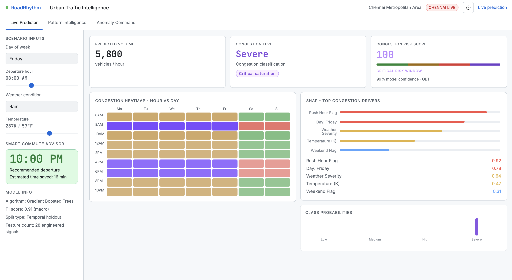
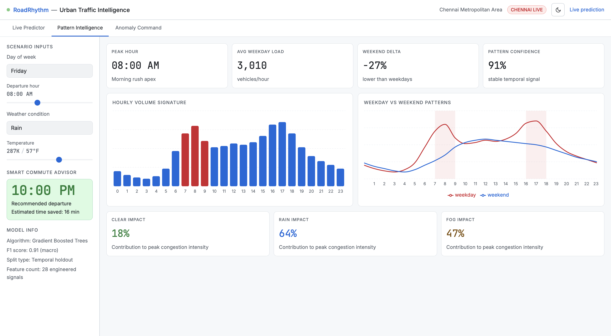
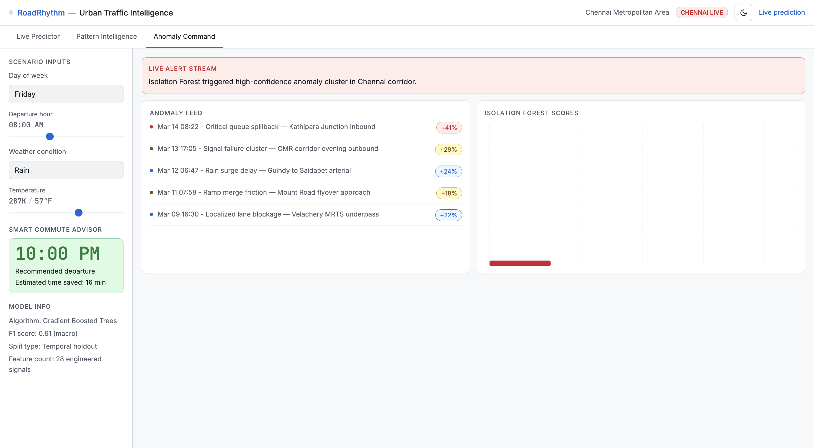

## Overview

RoadRhythm is a full-stack traffic intelligence system with:

- A modern web dashboard for scenario-based prediction
- A machine learning inference API
- Explainability and probability outputs for transparent decisions
- Pattern and anomaly views for operational awareness

The platform helps answer:
- What congestion level should I expect?
- How confident is the prediction?
- What is the best departure hour to reduce delay?

## Dashboard Screenshots

### Live Predictor

### Pattern Intelligence

### Anomaly Command

## Key Features

- Live Predictor
- Pattern Intelligence
- Anomaly Command
- Smart Commute Advisor
- SHAP-based model explainability
- Class probability visualization
- Light and dark mode UI
- API-backed real-time prediction flow

## Tech Stack

Frontend

- Next.js 14 (App Router)
- React
- TypeScript
- Tailwind CSS
- Recharts
- next-themes

Backend

- FastAPI
- scikit-learn
- XGBoost
- NumPy
- joblib
- Pydantic

Deployment

- Frontend: Vercel
- Backend: Railway

## Project Structure

- app: Next.js routes and pages
- components: reusable UI components
- lib: shared types and utility helpers
- backend: FastAPI service and model runtime files

## Architecture Flow

1. User changes scenario inputs: day, hour, weather, temperature
2. Frontend derives features such as is_weekend and is_rush_hour
3. Frontend sends request to backend prediction endpoint
4. Backend returns:
    - congestion_level
    - confidence
    - probabilities
    - best_hour
    - predicted_volume
5. Dashboard updates cards, charts, and advisor recommendations

## API Contract

POST /predict

Request body

- hour: integer
- day_of_week: integer
- is_weekend: integer (0 or 1)
- is_rush_hour: integer (0 or 1)
- weather_severity: integer
- temp: float

Response

- congestion_level: Low | Medium | High | Severe
- confidence: integer (0 to 100)
- probabilities:
    - Low
    - Medium
    - High
    - Severe
- best_hour: integer
- predicted_volume: integer

GET /health

- Returns status ok

## Environment Variables

Frontend environment variable:
NEXT_PUBLIC_API_URL=http://localhost:8000

For production, set NEXT_PUBLIC_API_URL to your Railway backend URL.

## Local Setup

### 1) Clone and install frontend dependencies

- npm install

### 2) Run frontend

- npm run dev

### 3) Setup backend

- Go to backend folder
- Install Python dependencies:
pip install -r requirements.txt

### 4) Start backend

- uvicorn main:app --reload --port 8000

### 5) Open app

- Frontend: [http://localhost:3000](http://localhost:3000/)
- Backend health: http://localhost:8000/health

## Deployment Notes

Vercel

- Deploy frontend from main branch
- Add NEXT_PUBLIC_API_URL in Vercel project environment variables

Railway

- Deploy backend folder
- Use start command:
uvicorn main:app --host 0.0.0.0 --port $PORT
- Ensure model.joblib is available in backend runtime

## Known Notes

- Recharts can show non-fatal width/height warnings during static generation
- If UI changes do not reflect after deploy, force refresh browser cache

## Future Improvements

- Live traffic stream ingestion
- Geo-map corridor visualization
- Alert subscriptions
- Continuous retraining and model drift monitoring